# Table of Contents
[LookdevTools](#LookdevTools)  
[Installation](#Installation)   
[Tools](#Tools)   
[&nbsp;&nbsp;&nbsp;&nbsp;Maya Surfacing Projects](#Maya-Surfacing-Projects)  
[&nbsp;&nbsp;&nbsp;&nbsp;Maya Surfacing Viewport](#Maya-Surfacing-Viewport)  
[&nbsp;&nbsp;&nbsp;&nbsp;txmake](#txmake)  
[&nbsp;&nbsp;&nbsp;&nbsp;Material Mapping](#Material-Mapping)  
[&nbsp;&nbsp;&nbsp;&nbsp;Katana Surfacing Projects](#Katana-Surfacing-Projects)  
[Macros and Gizmos](#Macros-and-Gizmos)  
[&nbsp;&nbsp;&nbsp;&nbsp;Katana](#Katana)   
[&nbsp;&nbsp;&nbsp;&nbsp;&nbsp;&nbsp;&nbsp;&nbsp;Material Lookdev](#Material-Lookdev)   
[&nbsp;&nbsp;&nbsp;&nbsp;&nbsp;&nbsp;&nbsp;&nbsp;TextureSet Loader](#TextureSet-Loader)   
[&nbsp;&nbsp;&nbsp;&nbsp;&nbsp;&nbsp;&nbsp;&nbsp;Texture Locatization](#Texture-Locatization)   
[&nbsp;&nbsp;&nbsp;&nbsp;&nbsp;&nbsp;&nbsp;&nbsp;Interactive Filters](#Interactive-Filters)   
[&nbsp;&nbsp;&nbsp;&nbsp;&nbsp;&nbsp;&nbsp;&nbsp;Grey Shaders Overrides](#Grey-Shaders-Overrides)   
[&nbsp;&nbsp;&nbsp;&nbsp;Nuke](#Nuke)   
[&nbsp;&nbsp;&nbsp;&nbsp;&nbsp;&nbsp;&nbsp;&nbsp;AOV correct](#AOV-Correct)   
[&nbsp;&nbsp;&nbsp;&nbsp;&nbsp;&nbsp;&nbsp;&nbsp;Lightgroups correct](#Lightgroups-Correct)   
[&nbsp;&nbsp;&nbsp;&nbsp;&nbsp;&nbsp;&nbsp;&nbsp;Lightgroups ContactSheet](#Lightgroups-ContactSheet)   
[Writing tools](#Writing-tools)   
[&nbsp;&nbsp;&nbsp;&nbsp;Example plugin](#Example-plugin)   
[Credits](#Credits)   

| WARNING: Under development, do not use (yet!) |
| --- |

# LookdevTools
A tool set for maya, katana, renderman, and nuke for surfacing and look development.  
It aims to be the missing glue between maya (uv prepping and organizing), mari/painter, and maya/katana rendering. Covering most of the repeatitive tasks, letting you focus on the surfacing.   

The rendering tools are based on Pixar Renderman.

# Installation
##### Root
<pre># Lookdevtools
export LOOKDEVTOOLS="/run/media/ezequielm/misc/wrk/dev/EZLookdevTools""</pre>
<pre>
# PYTHONPATH
export PYTHONPATH="${PYTHONPATH}:$LOOKDEVTOOLS"</pre>
<pre>
# Renderman RMAN
# Replace this path for your Renderman Install!!
export RMANTREE=/opt/pixar/RenderManProServer-22.5
export PATH="${PATH}:$RMANTREE/bin"
</pre>
<pre># NUKE
export NUKE_PATH=$NUKE_PATH:$LOOKDEVTOOLS/nuke/plugins</pre>
##### katana_tools
Add this to your katana launcher
<pre>## Lookdevtools
export LDT_KATANA_ROOT=$LOOKDEVTOOLS/katana
export LDT_KATANA_TOOLS=$LOOKDEVTOOLS/katana/katana_tools
export LDT_KATANA_SHELVES=$LOOKDEVTOOLS/katana/katana_shelves
export KATANA_RESOURCES=$KATANA_RESOURCES:$LDT_KATANA_TOOLS:$LDT_KATANA_SHELVES:$PB/katana_tools
</pre>
##### Mari
<pre>soon</pre>
##### Substance Painter
<pre>soon</pre>

# Tools

## Maya Surfacing Projects
This tools allows you to:
* Organize maya meshes into different surfacing projects, and surfacing objects.
* Merge meshes for surfacing
* Export alembic files for surfacing

### Hierarchical Structure Example
* room
  * Floor
    * wood
    * rug
  * walls
      * wallFront
      * wallLeft
      * skirtings
* armChair
  * leather
    * back
    * sit
    * sides
  * wood
    * armrests
    * legs

The pixar cabin, and kitchens shown here ready for surfacing
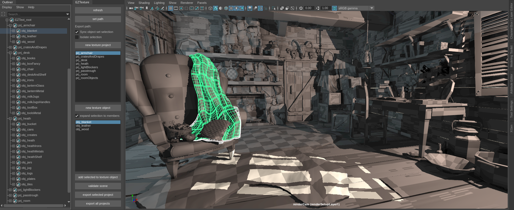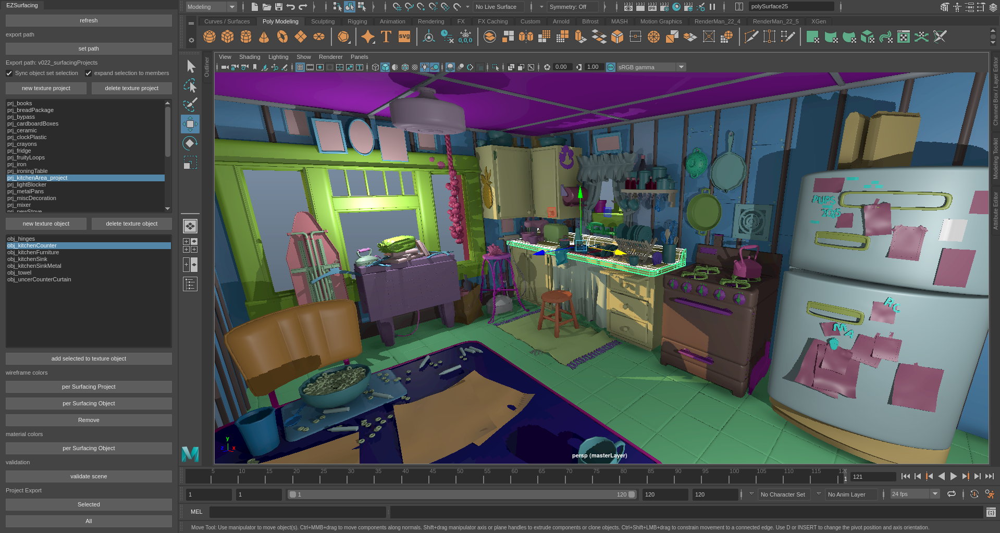


#### Export

##### Surfacing Projects:
It exports each surfacing projects as a single alembic file, containing its SurfacingObjects. 
Tipically this is the file you will bring to Mari or Substance Painter to create a single project.

##### SurfacingObjects
At export time, meshes inside a Surfacing Object will be merged to a single mesh.
The SurfacingObject will also be exported individually to a folder, named after the SurfacingProject they belong
```
As Mari is optimized for one single mesh, SurfacingObjects count inside a surfacing project is important.   
The amount of different meshes can impact your performance. The more meshes you have, the slower Mari will be.
It is not recommended using more than 8 meshes (or surfacing Objects) inside a Mari project.
```

###### Substance Painter Note
When using Substance Painter -with uDim-:
*  Meshes inside an SurfacingObject should be contained inside a single uDim  
   As these will be merged into a single mesh.
*  SurfacingObjects inside a SurfacingProject should not have overlapping Uvs.   

##### Maya Surfacing Viewport

Assign materials, or wireframe colors to surfacing projects or surfacing objects to visualize them in the Viewport.

## txmake

There are plenty of txmake tools available.  
What makes this tool slightly different is:
- multiprocessing: Run as many simultaneous txmakes as you want. This gives a performance boost of up to 9 times faster (as tested) when converting many textures at once.
- extra arguments list.
- search texture files recursively in a given folder.

## Material mapping

Imports textures into your maya scene.

Make sure the custom template matchs your file naming convention.
Read textures from a folder, and the tool will -for each texture file- load its surfacing project, surfacing_object, colorspace, textureset_element name as well as what shader_plug it should be connected in a PxrSurface shader, and group them together by udim.
Make any necessary changes in this excel like interface before importing. At this point you can change what the textures will be assigned too manually.
<pre>
{surfacing_project}_{surfacing_object}_{textureset_element}_{colorspace}.{UDim}.{extension}
For example:
   room_chair_baseColor_sRGB.1001.exr
</pre>


###### Note
The tool uses fuzzy string matching to give naming some flexibility to errors, different spellings, or camel casing.

## Katana Surfacing Projects

Creates collections based on the surfacing attributes found in the scene graph.
Creates materials based on the surfacing attributes
It can also assign colors in the VP, matching the colors of the maya Viewport materials and wireframe.

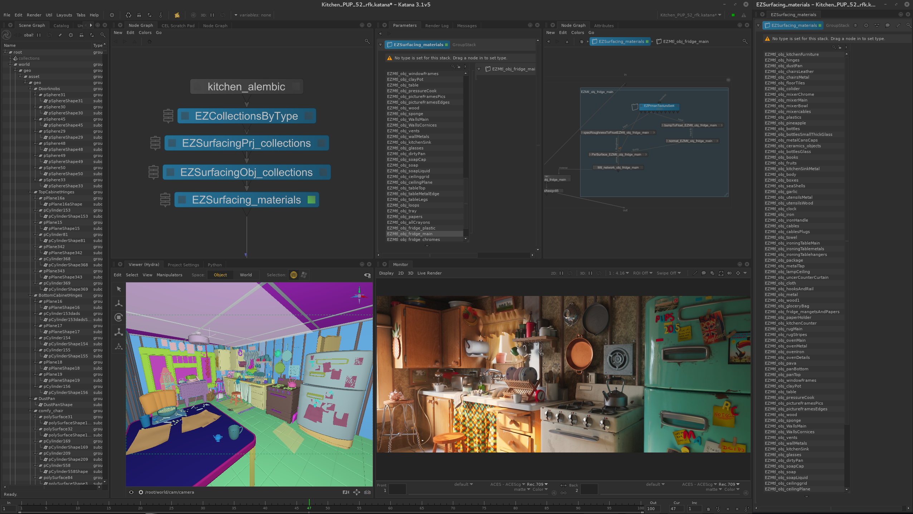

It can also be used to create collections of all unique values for any give attribute.

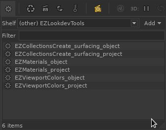

###### Note
A node must be selected before running, this node will be used as the scene point where to process and examine the scene graph locations.   

Collections, viewport colors, and material assignments are based on attribute values at locations as in.
```
/root/world//*{attr("geometry.arbitrary.myCustomAttribute") == value
```
The attributes used from this tools are
```
geometry.arbitrary.surfacing_project
geometry.arbitrary.surfacing_object
```

# Macros and Gizmos

## Katana

### Material Lookdev
Isolate materials from the scene and visualize them with a shaderBall.
Use the default Shaderball (cloth geo optional), or connect your own geometry.

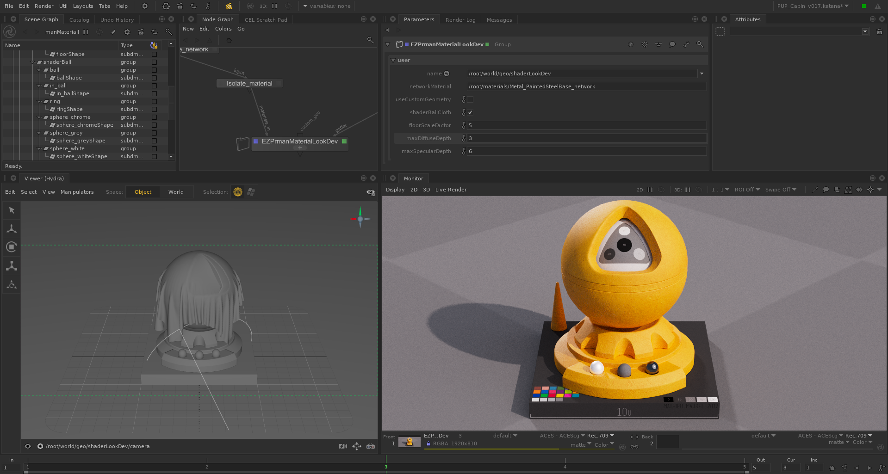

###### Note
Requires a gaffer input.

### TextureSet Loader
Loads multiple texture files using tokens or keywords.
Load materials or texture sets from substance, megascans, or mari with ease, in a single node.

Using the ```<element>``` keyword for each map, and ```_MAPID_``` for renderman to pick up uDIMs if an atlas style is selected.  
It also accepts a manifold input (of any type), for tiling.

```
Metal_PaintedSteelBase_<element>.tex   
woodenTable_<element>._MAPID_.tex
```

Each texture set element (for ie: baseColor, or normal) can be added to the list.

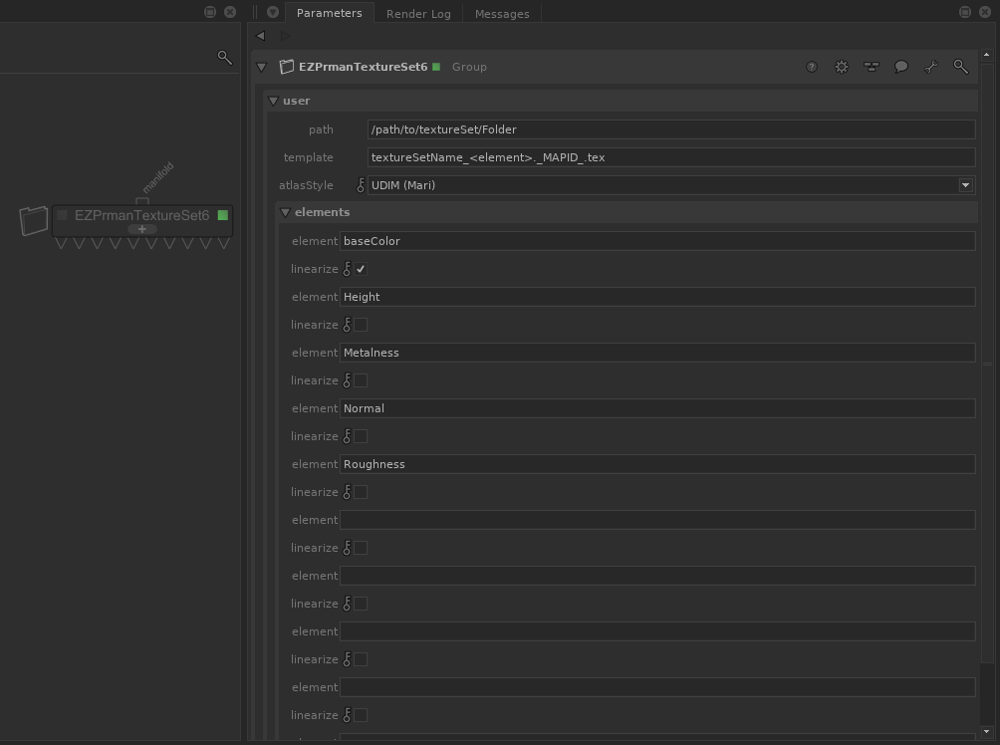


### Texture locatization
Opscript to search and replace paths in all PxrTexture nodes at ```.material.nodes```

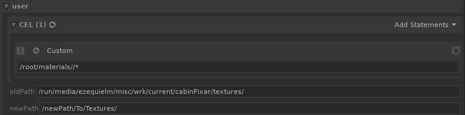

###### Note
Point this Opscript to /root/world/geo//*, in the case that kfls are assigned to the objects.
Or to /materials//* in case the materials are local to your scene.

### Interactive Filters
Miscelaneous interactive filters for renderman 22
* resolution half, third
* quality presets
* save n threads
* scanning options
* use it
* Integrators: occlusion, occlusion with albedo, direct lighting, and default
* subdmeshes to poly (aka: ignore subdivisions)
* Grey shader override, and diffuseColor override for all materials

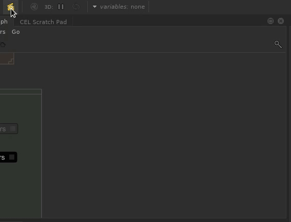

##### Grey shaders overrides
###### grey_shader:
This replaces all your shaders with a 0.18 standard material. 

###### grey_albedo:
This filter overrides only the diffuseColor with a 0.18 grey color.
Keeping all other materials values and maps, like specular, roughness, normals, diplacements, etc.

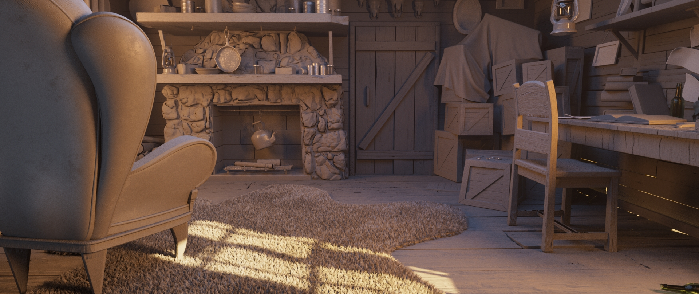

## Nuke
### AOV Correct
Select a nuke layer, and color correct it

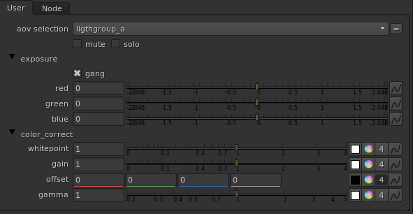

### Lightgroups Correct
Select a lightgroup layer from the preset menu, and mute/solo/color correct it

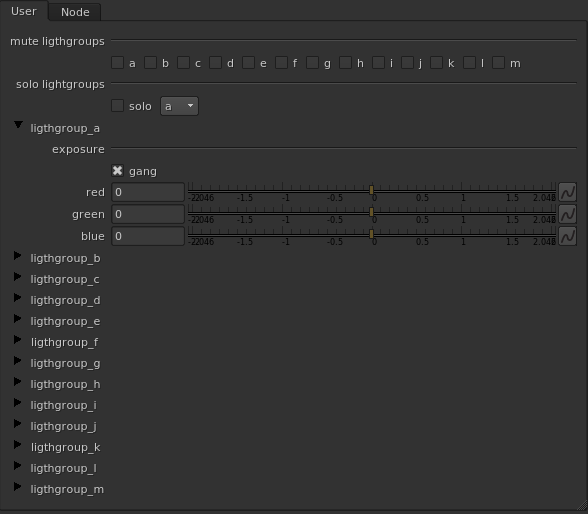

### Lightgroups contactSheet
Creates a contact sheet of all the default lightgroups

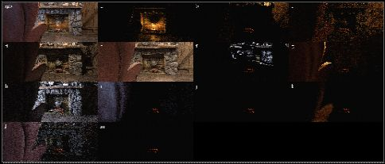

###### Note
Expects ligthgroups layers named as in: lightgroup_a, lightgroup_b, lightgroup_c. 

## Writing tools
### Developing Plugins
See yapsy documentation for more info   
http://yapsy.sourceforge.net/

### Example plugin
ExamplePlugIn.plugin_layout QtWidget is what you need to populate in order to add and show an UI.

<pre>tools/plugins/example_plugin/__init__.py</pre>

```

DCC_CONTEXT = None

try:
    # Add your imports here to make sure you
    # are in the correct dcc
    DCC_CONTEXT = True
except:
    logging.warning('PLUGIN: dcc packages not found')

class ExamplePlugIn(IPlugin):
    '''Example plugin'''
    name = "Example Plugin"

    plugin_layout = None

    def __init__ (self):
        if not DCC_CONTEXT:
            logging.warning('PLUGIN: ExamplePlugIn ui not loaded, dcc libs not found')
            self.plugin_layout = QtWidgets.QWidget()
            self.label_ui = QtWidgets.QLabel(self.plugin_layout)
            self.label_ui.setText(
                'ExamplePlugIn \nPlugin no available in this Application'
                )
        else:
            self.build_ui()
    
    def build_ui(self):
        '''Builds the ui for the plugin'''
        self.plugin_layout = QtWidgets.QWidget()
        plugin_layout = QtWidgets.QVBoxLayout()

        #UI Here

        # Set main layout
        self.plugin_layout.setLayout(plugin_layout)

```


<pre>tools/plugins/example_plugin.yapsy-plugin</pre>
```
[Core]
Name = Example plugin
Module = example_plugin

[Documentation]
Author = Ezequiel Mastrasso
Version = 1.0
Website = //ezequielm.com
Description = This is an example plugin configure, with UI entry points.
```

## Credits
Ezequiel Mastrasso  
Anant Gupta

### Open Source Packages

fuzzywuzzy   
lucidity   
yapsy   

### Shader Ball
Mathieu Maurel   
https://www.artstation.com/artwork/wKveZ

### Texture Patterns
Elias Wick   
https://polycount.com/discussion/186513/free-checker-pattern-texture

### Pixar kitchen surfacing
Surfacing, lighting, rendering was done by Ezequiel Mastrasso.
This images are part of the original speed surfacing exercise that give birth to these tools.  

However the look and style is based on the original winner of the pixar Kitchen challenge  
Fabio Rossi Sciedlarczyk (scied)