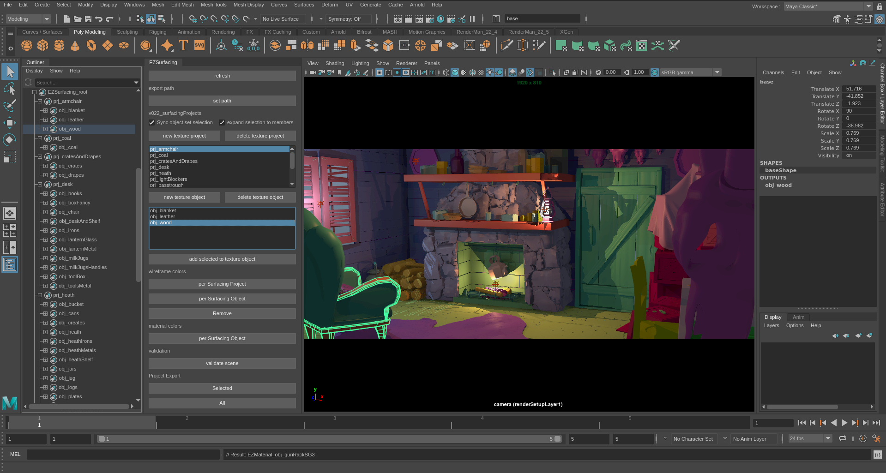

# Table of Contents
[LookdevTools](#LookdevTools)  
[Installation](#Installation)   
[&nbsp;&nbsp;&nbsp;Windows](#Windows)   
[&nbsp;&nbsp;&nbsp;Linux](#Linux)   
[Maya Surfacing Projects](#Maya-Surfacing-Projects)  
[&nbsp;&nbsp;&nbsp;Hierarchical Structure](#Hierarchical-Structure)  
[Katana Shelves](#Katana-Shelves)  
[Katana Renderman Macros](#Katana-Renderman-Macros)  
[&nbsp;&nbsp;&nbsp;MaterialLookdev](#MaterialLookdev)  
[&nbsp;&nbsp;&nbsp;TextureSet Loader](#TextureSet-Loader)  
[&nbsp;&nbsp;&nbsp;Collections and Materials](#Collections-and-Materials)  
[&nbsp;&nbsp;&nbsp;Interactive Filters](#Interactive-Filters)  
[&nbsp;&nbsp;&nbsp;Override albedo with grey](#Override-albedo-with-grey)  
[&nbsp;&nbsp;&nbsp;Texture locatization](#Texture-locatization)  
[Nuke Gizmos](#Nuke-Gizmos)  
[Writing tools](#Writing-tools)  
[Credits](#Credits)  


# LookdevTools
A tool set for maya, katana, renderman, and nuke for surfacing and look development.

# Installation
##### Tools
<pre>set EZ_ROOT=%PYTHONPATH%;/path/to/the/tools"</pre>
##### Python
<pre>set PYTHONPATH=%PYTHONPATH%;%EZ_ROOT%/"</pre>
##### Katana Tools
Add this to your katana launcher
<pre>set EZ_KATANA_TOOLS=%EZ_ROOT%/katana/katana_tools
set EZ_KATANA_SHELVES=%EZ_ROOT%/katana/katana_shelves
set KATANA_RESOURCES=%KATANA_RESOURCES%;%EZ_KATANA_TOOLS%;%EZ_KATANA_SHELVES%</pre>
##### Nuke Tools
<pre>set NUKE_PATH=%NUKE_PATH%;%EZ_ROOT%/nuke/plugins</pre>

# Maya Surfacing Projects
This tools allows you to organize and group your maya meshes into different surfacing projects, and surfacing objects.
Also handles projects export to alembic files, and surfacing objects merging.
The attributes added to the meshes transforms allows the assignment of materials and textureSets programatically (currently katana only, see katana shelves).


##### USAGE
```
import tools.ui as tools.ui
```


The pixar cabin, and kitchens shown here ready for surfacing


## Hierarchical Structure
* Surfacing_projectA
  * Surfacing_objectA
    * mesh1
    * mesh2
    * mesh3
  * Surfacing_objectA
      * mesh1
      * mesh2
      * mesh3
* Surfacing_projectB
  * Surfacing_objectB
    * mesh4
    * mesh5

##### SurfacingObject  
All meshses inside a SurfacingObject will be merged to a single geometry for export.
The SurfacingObject will also be exported individually to a folder, named after the SurfacingProject they belong
```
SurfacingObject meshes are important for Mari where the amount of different meshes can impact your
performance,as Mari is optimized for one single mesh. The more meshes, the slower Mari will be,
It is not recommended using more than 6 meshes (or surfacing Objects) inside a Mari project.
```

##### SurfacingObject:
This will export as single alembic, containing its SurfacingObject as single meshes. 
Tipically this is the file you will bring to Mari or Substance Painter to create a single project.

##### Note
If using substance painter -using uDim- meshes inside an SurfacingObject should be contained inside a single uDim!
All SurfacingObjects inside a SurfacingProject should not overlap.

# Katana Shelves

# Katana Renderman Macros

## MaterialLookdev
Quickly isolate materials from the scene and visualize them.
Use the default Shaderball (cloth geo optional), or connect your own geometry.  
Requires a gaffer input.


## TextureSet Loader
This macro allows to load multiple texture files using tokens or keywords.
Load materials or texture sets from substance, megascans, or mari with ease, in a single node.

Using the ```<element>``` keyword for each map, and ```_MAPID_``` for renderman to pick up uDIMs if an atlas style is selected.  
It also accepts a manifold input (of any type), for tiling.

```
Metal_PaintedSteelBase_<element>.tex   
woodenTable_<element>._MAPID_.tex
```

Each texture set element (for ie: baseColor, or normal) can be added to the list.


## Collections and Materials
Run EZCollections from the shelve to automaticaly create collections based on the EZ attributes found in the scene graph.
Create either the Surfacing Project, or the Surfacing Object collections.
A node must be selected before running, this node will be used as the scene point where to process and examine the scene graph locations.   

It can also be used to create collections of all unique values for any give attribute


Collection, viewport colors and material assignments are based on attribute values at locations as in.
```
/root/world//*{attr("geometry.arbitrary.myCustomAttribute") == value
```
The attributes used from this tools are
```
geometry.arbitrary.surfacing_project
geometry.arbitrary.surfacing_object
```


## Texture locatization
Opscript to search and replace paths in all PxrTexture nodes inside a network material at scenegraph location's ```.material.nodes```


### Interactive Filters
Miscelaneous interactive filters for renderman 22
* resolution half, third
* quality presets
* save n threads
* scanning options
* use it
* Integrators: occlusion, occlusion with albedo, direct lighting, and default
* subdmeshes to poly (aka: ignore subdivisions)
* Grey shader override, and diffuseColor override for all materials


##### Grey shaders overrides
###### grey_shader:
This replaces all your shaders with a 0.18 standard material. 

###### grey_albedo:
This filter overrides only the diffuseColor with a 0.18 grey color.
Keeping all other materials values and maps, like specular, roughness, normals, diplacements, etc.


# Nuke Gizmos
## AOV Correct
Select a nuke layer, and color correct it


## Lightgroups Correct
Select a lightgroup layer from the preset menu, and mute/solo/color correct it


## Lightgroups contactSheet
Creates a contact sheet of all the default lightgroups


# Credits
Ezequiel Mastrasso  
Anant Gupta

## Shader Ball
Mathieu Maurel
https://www.artstation.com/artwork/wKveZ

## Texture Patterns
Elias Wick
https://polycount.com/discussion/186513/free-checker-pattern-texture

## Pixar kitchen surfacing
Surfacing, lighting, rendering was done by Ezequiel Mastrasso.
This images are part of the original speed surfacing exercise that give birth to these tools.  

However the look and style is based on the original winner of the pixar Kitchen challenge  
Fabio Rossi Sciedlarczyk (scied)

# Writing tools
## Developing Plugins
Requires yapsy (included in tools/external)

## Example plugin
ExamplePlugIn.plugin_layout QtWidget is what you need to populate in order to add and show an UI.

<pre>tools/plugins/example_plugin/__init__.py</pre>

```
class ExamplePlugIn(IPlugin):
    '''Example plugin'''
    name = "Example Plugin"

    plugin_layout = None

    def __init__ (self):
        logging.info('PLUGIN: example_plugin loaded')
        self.plugin_layout = QtWidgets.QWidget()

        self.label_ui = QtWidgets.QLabel(self.plugin_layout)
        self.label_ui.setText('example PlugIn UI')
```


<pre>tools/plugins/example_plugin.yapsy-plugin</pre>
```
[Core]
Name = Example plugin
Module = example_plugin

[Documentation]
Author = Ezequiel Mastrasso
Version = 1.0
Website = //ezequielm.com
Description = This is an example plugin configure, with UI entry points.
```