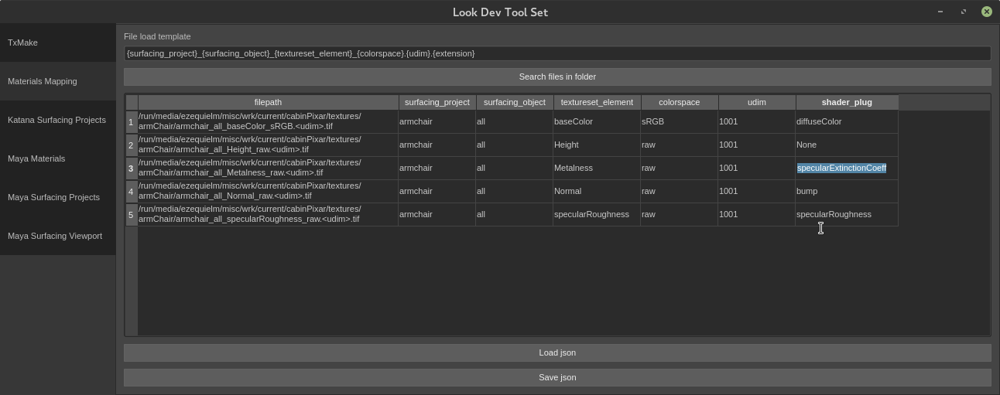
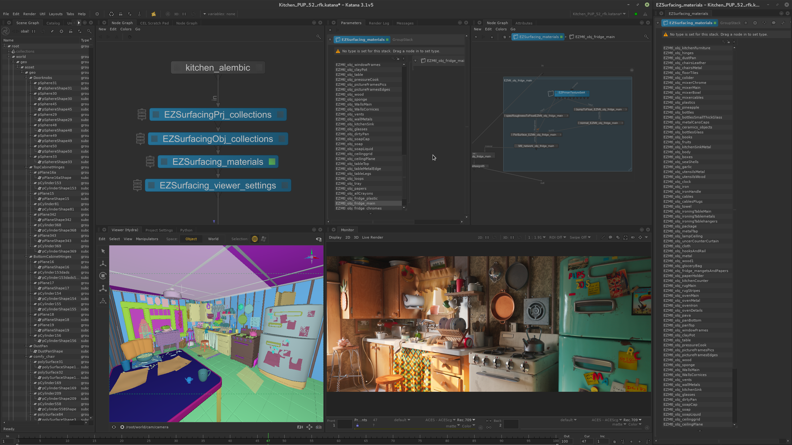
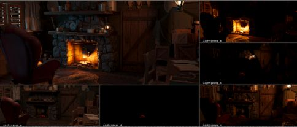

# Table of Contents
[LookdevTools](#LookdevTools)  
[Installation](#Installation)   
[Tools](#Tools)   
[&nbsp;&nbsp;&nbsp;&nbsp;Maya Surfacing Projects](#Maya-Surfacing-Projects)  
[&nbsp;&nbsp;&nbsp;&nbsp;Maya Surfacing Viewport](#Maya-Surfacing-Viewport)  
[&nbsp;&nbsp;&nbsp;&nbsp;Maya Surfacing](#Maya-Surfacing)  
[&nbsp;&nbsp;&nbsp;&nbsp;Material Mapping](#Material-Mapping)  
[&nbsp;&nbsp;&nbsp;&nbsp;Katana Surfacing Projects](#Katana-Surfacing-Projects)  
[Macros and Gizmos](#Macros-and-Gizmos)  
[&nbsp;&nbsp;&nbsp;&nbsp;Katana](#Katana)   
[&nbsp;&nbsp;&nbsp;&nbsp;&nbsp;&nbsp;&nbsp;&nbsp;Material Lookdev](#Material-Lookdev)   
[&nbsp;&nbsp;&nbsp;&nbsp;&nbsp;&nbsp;&nbsp;&nbsp;TextureSet Loader](#TextureSet-Loader)   
[&nbsp;&nbsp;&nbsp;&nbsp;&nbsp;&nbsp;&nbsp;&nbsp;Texture Locatization](#Texture-Locatization)   
[&nbsp;&nbsp;&nbsp;&nbsp;&nbsp;&nbsp;&nbsp;&nbsp;Interactive Filters](#Interactive-Filters)   
[&nbsp;&nbsp;&nbsp;&nbsp;&nbsp;&nbsp;&nbsp;&nbsp;Grey Shaders Overrides](#Grey-Shaders-Overrides)   
[&nbsp;&nbsp;&nbsp;&nbsp;Nuke](#Nuke)   
[&nbsp;&nbsp;&nbsp;&nbsp;&nbsp;&nbsp;&nbsp;&nbsp;AOV correct](#AOV-Correct)   
[&nbsp;&nbsp;&nbsp;&nbsp;&nbsp;&nbsp;&nbsp;&nbsp;Lightgroups correct](#Lightgroups-Correct)   
[&nbsp;&nbsp;&nbsp;&nbsp;&nbsp;&nbsp;&nbsp;&nbsp;Lightgroups ContactSheet](#Lightgroups-ContactSheet)   
[Writing tools](#Writing-tools)   
[&nbsp;&nbsp;&nbsp;&nbsp;Example plugin](#Example-plugin)   
[Credits](#Credits)   

| WARNING: Under development, do not use (yet!) |
| --- |

# LookdevTools
A tool set for maya, katana, renderman, and nuke for surfacing and look development.  
It aims to be the missing glue between maya (uv prepping and organizing), mari/painter, and maya/katana rendering. Covering most of the repeatitive tasks, letting you focus on the surfacing.   

The rendering tools are based on Pixar Renderman.

# Installation
##### Root
<pre># Lookdevtools
export LOOKDEVTOOLS="/run/media/ezequielm/misc/wrk/dev/EZLookdevTools""</pre>
<pre>
# PYTHONPATH
export PYTHONPATH="${PYTHONPATH}:$LOOKDEVTOOLS"</pre>
<pre>
# Renderman RMAN
# Replace this path for your Renderman Install!!
export RMANTREE=/opt/pixar/RenderManProServer-22.5
export PATH="${PATH}:$RMANTREE/bin"
</pre>
<pre># NUKE
export NUKE_PATH=$NUKE_PATH:$LOOKDEVTOOLS/nuke/plugins</pre>
##### katana_tools
Add this to your katana launcher
<pre>## Lookdevtools
export LDT_KATANA_ROOT=$LOOKDEVTOOLS/katana
export LDT_KATANA_TOOLS=$LOOKDEVTOOLS/katana/katana_tools
export LDT_KATANA_SHELVES=$LOOKDEVTOOLS/katana/katana_shelves
export KATANA_RESOURCES=$KATANA_RESOURCES:$LDT_KATANA_TOOLS:$LDT_KATANA_SHELVES:$PB/katana_tools
</pre>
##### Mari
<pre>soon</pre>
##### Substance Painter
<pre>soon</pre>

# Tools

## Maya Surfacing Projects
This tools allows you to organize and group your maya meshes into different surfacing projects, and surfacing objects.
Also handles projects export to alembic files, and surfacing objects merging.
The attributes added to the meshes transforms allows the assignment of materials and textureSets programatically (currently katana only, see katana shelves).


The pixar cabin, and kitchens shown here ready for surfacing


## Hierarchical Structure
* Surfacing_projectA
  * Surfacing_objectA
    * mesh1
    * mesh2
    * mesh3
  * Surfacing_objectA
      * mesh1
      * mesh2
      * mesh3
* Surfacing_projectB
  * Surfacing_objectB
    * mesh4
    * mesh5

##### SurfacingObject  
All meshses inside a SurfacingObject will be merged to a single geometry for export.
The SurfacingObject will also be exported individually to a folder, named after the SurfacingProject they belong
```
SurfacingObject meshes are important for Mari where the amount of different meshes can impact your
performance,as Mari is optimized for one single mesh. The more meshes, the slower Mari will be,
It is not recommended using more than 6 meshes (or surfacing Objects) inside a Mari project.
```

##### SurfacingObject:
This will export as single alembic, containing its SurfacingObject as single meshes. 
Tipically this is the file you will bring to Mari or Substance Painter to create a single project.

###### Note
If using substance painter -using uDim- meshes inside an SurfacingObject should be contained inside a single uDim!
All SurfacingObjects inside a SurfacingProject should not overlap.

## Maya Surfacing Viewport

Assign blank materials, or wireframe colors to surfacing projects or surfacing objects 

## Maya Surfacing

Create shaders, import textures, and assign them to the meshes.  
There is 2 ways to do this:  
1 - From a folder
2 - From a json material config file

If you are sure your textures are named correctly, select a folder and let the tools figure out the rest
If unsure, first use the Material Mapping tool to check that all textures data from names are read correctly, make changes if needed, and save the settings as a json file.

## Material mapping

Load all textures from a folder, and the tool will -for each texturing file- load its surfacing project, surfacing_object, colorspace, textureset_element name as well as what shader_plug it should be connected in a PxrSurface shader.
Make any necessary changes in this excel like interface before exporting this as a material setup json file.
This json file will be essentially your glue between the individual textures and meshes for automatic material creations.   
The tool uses fuzzy string matching to give naming some flexibility to errors, different spellings, or camel casing
However, the texture template from config/constants.py should match
<pre>
{surfacing_project}_{surfacing_object}_{textureset_element}_{colorspace}.{UDim}.{extension}
For example:
   room_chair_baseColor_sRGB.1001.exr
</pre>



## Katana Surfacing Projects

Run collection create from the shelve to automaticaly create collections based on the surfacing attributes found in the scene graph.
Create either the Surfacing Project, or the Surfacing Object collections.
A node must be selected before running, this node will be used as the scene point where to process and examine the scene graph locations.   

It can also be used to create collections of all unique values for any give attribute


Collection, viewport colors and material assignments are based on attribute values at locations as in.
```
/root/world//*{attr("geometry.arbitrary.myCustomAttribute") == value
```
The attributes used from this tools are
```
geometry.arbitrary.surfacing_project
geometry.arbitrary.surfacing_object
```


# Macros and Gizmos

## Katana

### Material Lookdev
Quickly isolate materials from the scene and visualize them.
Use the default Shaderball (cloth geo optional), or connect your own geometry.  
Requires a gaffer input.


### TextureSet Loader
This macro allows to load multiple texture files using tokens or keywords.
Load materials or texture sets from substance, megascans, or mari with ease, in a single node.

Using the ```<element>``` keyword for each map, and ```_MAPID_``` for renderman to pick up uDIMs if an atlas style is selected.  
It also accepts a manifold input (of any type), for tiling.

```
Metal_PaintedSteelBase_<element>.tex   
woodenTable_<element>._MAPID_.tex
```

Each texture set element (for ie: baseColor, or normal) can be added to the list.


### Texture locatization
Opscript to search and replace paths in all PxrTexture nodes inside a network material at scenegraph location's ```.material.nodes```


### Interactive Filters
Miscelaneous interactive filters for renderman 22
* resolution half, third
* quality presets
* save n threads
* scanning options
* use it
* Integrators: occlusion, occlusion with albedo, direct lighting, and default
* subdmeshes to poly (aka: ignore subdivisions)
* Grey shader override, and diffuseColor override for all materials


##### Grey shaders overrides
###### grey_shader:
This replaces all your shaders with a 0.18 standard material. 

###### grey_albedo:
This filter overrides only the diffuseColor with a 0.18 grey color.
Keeping all other materials values and maps, like specular, roughness, normals, diplacements, etc.


## Nuke
### AOV Correct
Select a nuke layer, and color correct it


### Lightgroups Correct
Select a lightgroup layer from the preset menu, and mute/solo/color correct it


### Lightgroups contactSheet
Creates a contact sheet of all the default lightgroups



## Writing tools
### Developing Plugins
See yapsy documentation for more info   
http://yapsy.sourceforge.net/

### Example plugin
ExamplePlugIn.plugin_layout QtWidget is what you need to populate in order to add and show an UI.

<pre>tools/plugins/example_plugin/__init__.py</pre>

```

DCC_CONTEXT = None

try:
    # Add your imports here to make sure you
    # are in the correct dcc
    DCC_CONTEXT = True
except:
    logging.warning('PLUGIN: dcc packages not found')

class ExamplePlugIn(IPlugin):
    '''Example plugin'''
    name = "Example Plugin"

    plugin_layout = None

    def __init__ (self):
        if not DCC_CONTEXT:
            logging.warning('PLUGIN: ExamplePlugIn ui not loaded, dcc libs not found')
            self.plugin_layout = QtWidgets.QWidget()
            self.label_ui = QtWidgets.QLabel(self.plugin_layout)
            self.label_ui.setText(
                'ExamplePlugIn \nPlugin no available in this Application'
                )
        else:
            self.build_ui()
    
    def build_ui(self):
        '''Builds the ui for the plugin'''
        self.plugin_layout = QtWidgets.QWidget()
        plugin_layout = QtWidgets.QVBoxLayout()

        #UI Here

        # Set main layout
        self.plugin_layout.setLayout(plugin_layout)

```


<pre>tools/plugins/example_plugin.yapsy-plugin</pre>
```
[Core]
Name = Example plugin
Module = example_plugin

[Documentation]
Author = Ezequiel Mastrasso
Version = 1.0
Website = //ezequielm.com
Description = This is an example plugin configure, with UI entry points.
```

## Credits
Ezequiel Mastrasso  
Anant Gupta

### Open Source Packages

fuzzywuzzy   
lucidity   
yapsy   

### Shader Ball
Mathieu Maurel   
https://www.artstation.com/artwork/wKveZ

### Texture Patterns
Elias Wick   
https://polycount.com/discussion/186513/free-checker-pattern-texture

### Pixar kitchen surfacing
Surfacing, lighting, rendering was done by Ezequiel Mastrasso.
This images are part of the original speed surfacing exercise that give birth to these tools.  

However the look and style is based on the original winner of the pixar Kitchen challenge  
Fabio Rossi Sciedlarczyk (scied)